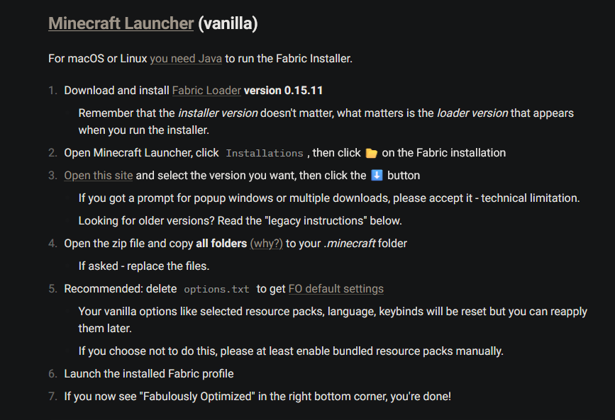

Fabric loader (needed to install performance optimizations and mods for your client).

1. Download the installer from here: https://fabricmc.net/use/installer/
2. Launch it and install the 1.21 version
3. Start your MC launcher and launch with the Fabric installation

Mods (for performance and other stuff)
1. Download the 6.0.0 alpha from here: https://download.fo/vanilla
2. Follow the instructions to install Fabulously Optimized for "Minecraft Launcher vanilla".
3. To get to your .minecraft folder, type in "%appdata%" in your startmenu and press Enter. At the top of File Explorer you should see a ".minecraft" folder.

If you want a different resourepack or shaders you can add in the resourcepack or shaderpacks folders in .minecraft as well. 